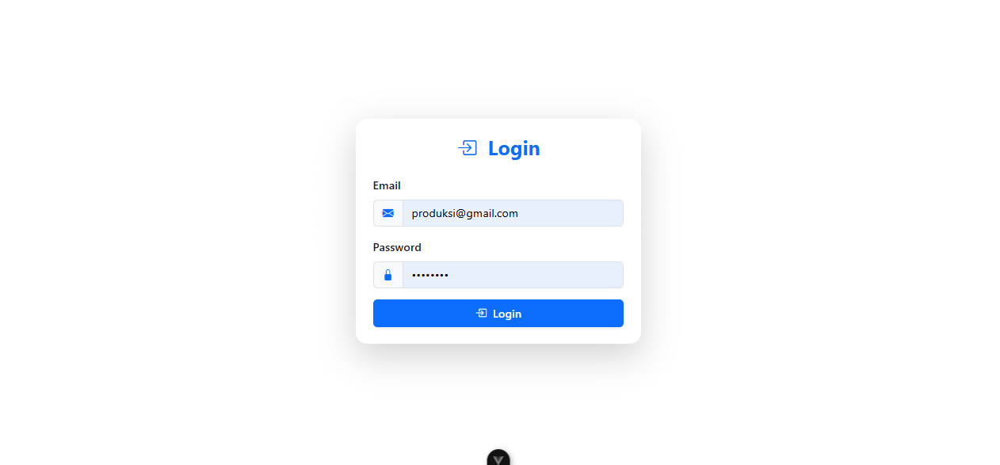
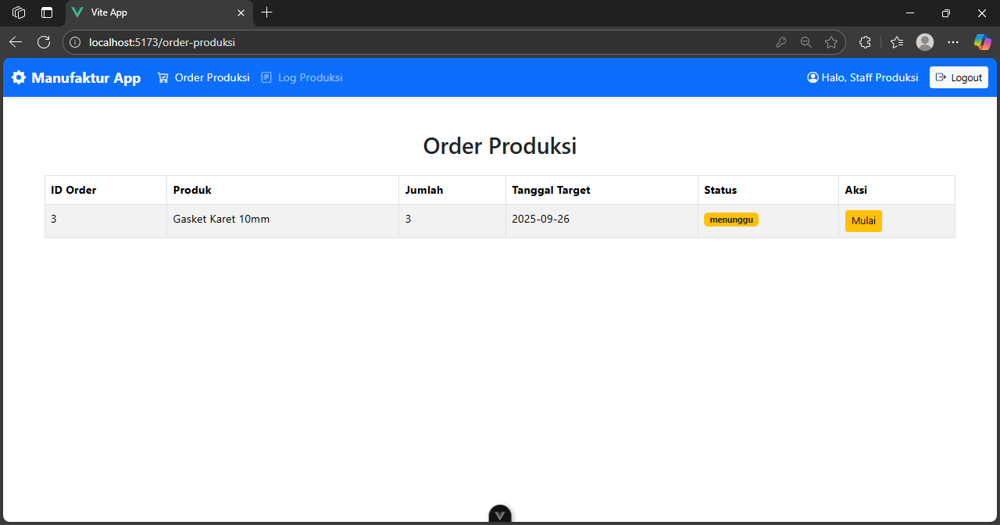
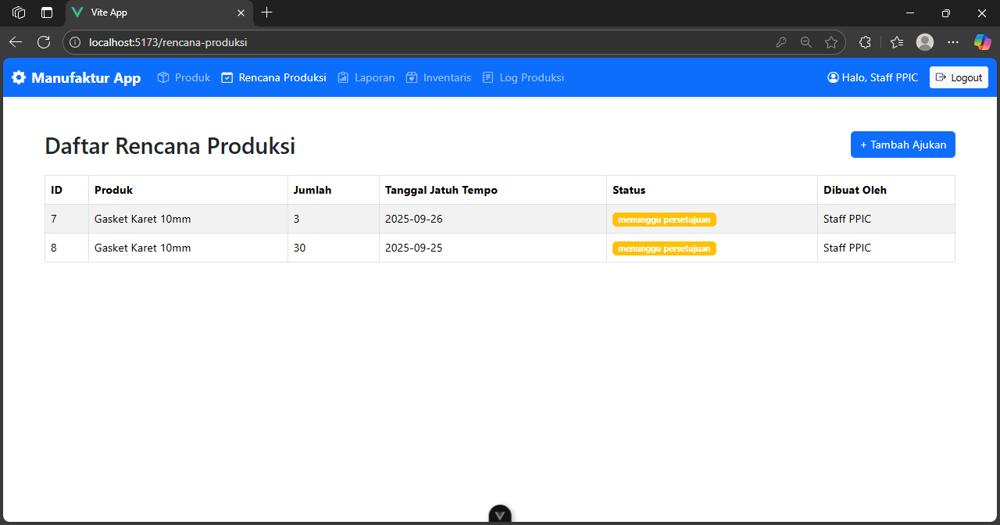

# Manufaktur-Frontend-Vue

Proyek ini adalah bagian frontend dari sistem manufaktur yang dibangun dengan framework **Vue.js 3** dan menggunakan **Vue Router** untuk navigasi. Frontend ini berinteraksi dengan API backend yang dibuat dengan Laravel.

## Fitur Utama

* **Login**: Halaman login untuk pengguna.
* **Rencana Produksi**: Halaman untuk Staff PPIC membuat rencana produksi.
* **Order Produksi**: Halaman untuk Staff Produksi melihat dan mengelola order.
* **Laporan Produksi**: Halaman untuk Manajer dan Staff PPIC melihat laporan.
* **Log Produksi**: Halaman untuk melihat riwayat perubahan status setiap order.
* **Inventaris**: Halaman untuk melihat stok barang jadi di gudang.

## Pratinjau Tampilan

**(Maaf jika tampilannya masih berantakan, karna pertama kali mencoba membuat front end menggunakan vue.js)**
Berikut adalah contoh tangkapan layar dari beberapa halaman utama:

* **Halaman Login**
    

* **Halaman Rencana Produksi**
   

* **Halaman Order Produksi**
   

## Informasi Login

Gunakan kredensial berikut untuk login dan menguji fungsionalitas aplikasi:

* **Manajer**:
    * Email: `manager@gmail.com`
    * Password: `password`

* **Staff PPIC**:
    * Email: `ppic@gmail.com`
    * Password: `password`

* **Staff Produksi**:
    * Email: `produksi@gmail.com`
    * Password: `password`

    
## Persyaratan Sistem

* Node.js (LTS)
* npm atau yarn

## Cara Menjalankan Proyek

1.  **Kloning Repositori**:
    ```bash
    git clone https://github.com/fpendii/manufaktur-frontend-vue.git
    cd manufaktur-frontend-vue
    ```

2.  **Instalasi Dependensi**:
    ```bash
    npm install
    npm install axios
    ```

3.  **Konfigurasi API**:
    * Buka file `src/main.js` atau file konfigurasi `axios` Anda. Pastikan baseURL mengarah ke API Laravel.
    ```javascript
    // src/main.js
    import axios from 'axios';
    axios.defaults.baseURL = 'http://localhost:8000/api'; /
    *** NOTE : Pastikan backend berjalan di url 'http://localhost:8000', karna jika tidak banyak halaman front end yang akan error
    ```

4.  **Jalankan Server**:
    ```bash
    npm run dev
    ```
    Aplikasi akan berjalan di `http://localhost:5173` atau port lain yang tersedia.

## Link Repositori Terkait

* **Backend (Laravel)**: https://github.com/fpendii/manufaktur-backend-v10.git
\
